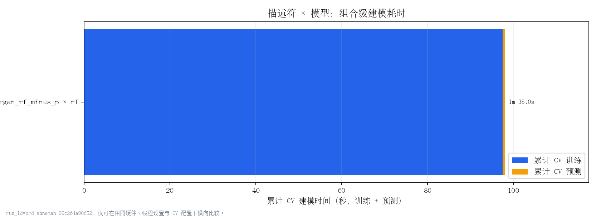
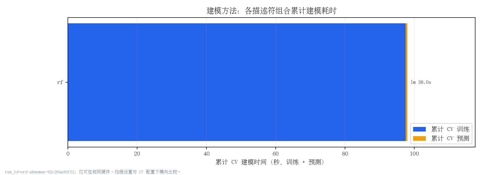
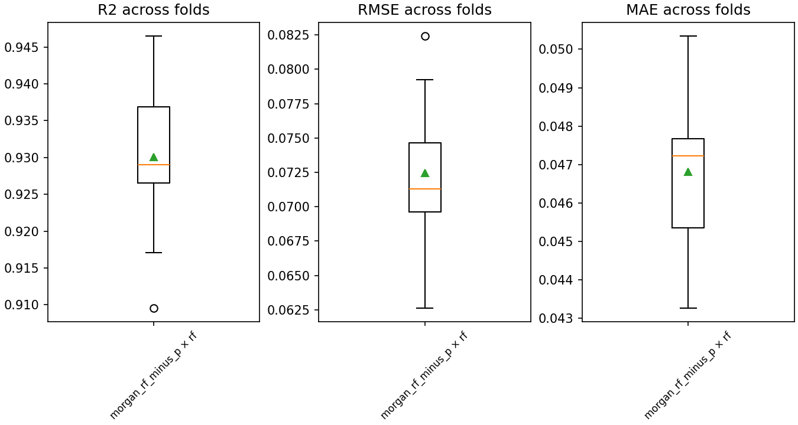
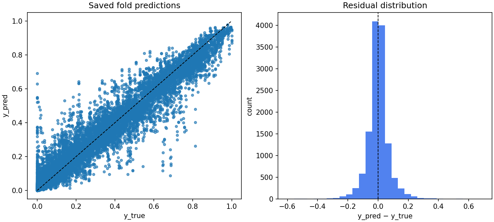

# YONOD 严谨模型比较报告

生成时间：`2026-09-23 01:37:02`  
run_id：`ord-ahneman-92c264a90f52`

> 本报告只读取 `docs/manifests/`、`docs/predictions/`、`docs/folds/` 和 `docs/metrics/`，不重新训练模型。

## 实验可追溯性

| run_id | config_hash | dataset_sha256 | code_git_commit | dataset_path | grouping | cv | derived_from |
|---|---|---|---|---|---|---|---|
| ord-ahneman-92c264a90f52 | 92c264a90f52bad9bd1cb170d9e70985cf1591f63590f2dee79cfad27ad6e398 | ff085b88c0b1f101d3fe8811c110aecfaa18d2d8a0c69f248441f09c4267ede2 | 47523b54a2dd5c75103ef3de4e91514c7f4d71e2 | /home/wangzh685/桌面/ord-data/YONOD/result/pnecessity_utility_prepare_v1/data/ord_ahneman.csv | {"group_column": "non_p_input_group_id", "max_group_fraction": 0.8, "protocol_label": "pnecessity_within_source_non_p_input", "strategy": "precomputed_column"} | {"n_repeats": 3, "n_splits": 5, "seed": 20260918} | docs/manifests/, docs/predictions/, docs/folds/, docs/metrics/ |

## 论文协议对齐状态

此处记录特征、切分与随机种子的运行证据；流程对齐不等同于论文数值复现，仍需核对数据和软件版本。

| protocol | status |
|---|---|
| 未声明论文协议 | 通用 benchmark；不可据此宣称论文流程对齐 |

## 切分审计

| split_id | repeat | fold | n_train | n_valid | n_train_groups | n_valid_groups | max_group_size | group_leakage |
|---|---|---|---|---|---|---|---|---|
| split-4d799b322ebf | 1 | 1 | 3449 | 863 | 3449 | 863 | 1 | False |
| split-4d799b322ebf | 1 | 2 | 3449 | 863 | 3449 | 863 | 1 | False |
| split-4d799b322ebf | 1 | 3 | 3450 | 862 | 3450 | 862 | 1 | False |
| split-4d799b322ebf | 1 | 4 | 3450 | 862 | 3450 | 862 | 1 | False |
| split-4d799b322ebf | 1 | 5 | 3450 | 862 | 3450 | 862 | 1 | False |
| split-4d799b322ebf | 2 | 1 | 3449 | 863 | 3449 | 863 | 1 | False |
| split-4d799b322ebf | 2 | 2 | 3449 | 863 | 3449 | 863 | 1 | False |
| split-4d799b322ebf | 2 | 3 | 3450 | 862 | 3450 | 862 | 1 | False |
| split-4d799b322ebf | 2 | 4 | 3450 | 862 | 3450 | 862 | 1 | False |
| split-4d799b322ebf | 2 | 5 | 3450 | 862 | 3450 | 862 | 1 | False |
| split-4d799b322ebf | 3 | 1 | 3449 | 863 | 3449 | 863 | 1 | False |
| split-4d799b322ebf | 3 | 2 | 3449 | 863 | 3449 | 863 | 1 | False |
| split-4d799b322ebf | 3 | 3 | 3450 | 862 | 3450 | 862 | 1 | False |
| split-4d799b322ebf | 3 | 4 | 3450 | 862 | 3450 | 862 | 1 | False |
| split-4d799b322ebf | 3 | 5 | 3450 | 862 | 3450 | 862 | 1 | False |

## 描述符预计算状态

建模任务只读取 `descriptors/*.npz`；失败描述符的模型任务被隔离跳过。

| descriptor | status | stage | artifact_path | n_total | n_valid | feature_dim | skipped_model_count | reason |
|---|---|---|---|---|---|---|---|---|
| morgan_rf_minus_p | computed | precompute | /home/wangzh685/桌面/ord-data/YONOD/result/pnecessity_utility_ord_ahneman_morgan_rf_minus_p_v1/feature/morgan_rf_minus_p.npz | 4312 | 4312 | 10240 | 0 | 首次生成描述符文件 |

## 模型协议与严格排名守卫

strict benchmark 的比较/排名只纳入 `evaluation_protocol=manifest_outer_cv` 且 expected/valid fold 完整的组合；旧 `autogluon_internal_holdout` 只展示并明确排除。

| split_id | descriptor | model | evaluation_protocol | expected_folds | valid_metric_folds | is_complete | strict_rank_eligible | strict_rank_exclusion_reason | autogluon_time_limit | autogluon_presets | autogluon_num_cpus | autogluon_seed_policy | autogluon_version | model_artifact_cleanup |
|---|---|---|---|---|---|---|---|---|---|---|---|---|---|---|
| split-4d799b322ebf | morgan_rf_minus_p | rf | manifest_outer_cv | 15 | 15 | True | True | 可进入 strict benchmark 比较/排名 | — | — | — | — | — | — |

## 性能矩阵与完成度

| split_id | evaluation_protocol | descriptor | model | r2 | r2_std | rmse | rmse_std | mae | mae_std | complete | expected_folds | valid_metric_folds |
|---|---|---|---|---|---|---|---|---|---|---|---|---|
| split-4d799b322ebf | manifest_outer_cv | morgan_rf_minus_p | rf | 0.9301 | 0.0091 | 0.0725 | 0.0048 | 0.0468 | 0.0021 | True | 15 | 15 |

| run_id | config_hash | split_id | evaluation_protocol | descriptor | model | expected_folds | available_folds | valid_metric_folds | is_complete | missing_or_excluded_reason |
|---|---|---|---|---|---|---|---|---|---|---|
| ord-ahneman-92c264a90f52 | 92c264a90f52bad9bd1cb170d9e70985cf1591f63590f2dee79cfad27ad6e398 | split-4d799b322ebf | manifest_outer_cv | morgan_rf_minus_p | rf | 15 | 15 | 15 | True |  |

## 建模耗时与成本对比

时间口径：`total_model_time_s = total_train_time_s + total_predict_time_s`，均为该组合全部有效外部 CV fold 的累计值。描述符特征化与 CLI 端到端墙钟时间不计入柱状图；不完整、缺失或非法时间的组合保留状态，但不进入耗时排序。描述符和建模方法图是组合成本的两种汇总视图，不应与组合图相加，也不把共享特征化时间重复归因给模型。

### 描述符 × 建模方法组合

| run_id | config_hash | split_id | evaluation_protocol | descriptor | model | expected_folds | completed_folds | is_complete | time_status | time_status_detail | is_time_comparable | total_train_time_s | mean_train_time_s | median_train_time_s | max_train_time_s | total_predict_time_s | total_model_time_s |
|---|---|---|---|---|---|---|---|---|---|---|---|---|---|---|---|---|---|
| ord-ahneman-92c264a90f52 | 92c264a90f52bad9bd1cb170d9e70985cf1591f63590f2dee79cfad27ad6e398 | split-4d799b322ebf | manifest_outer_cv | morgan_rf_minus_p | rf | 15 | 15 | True | complete_and_comparable |  | True | 97.4845 | 6.4990 | 6.4466 | 6.7572 | 0.4913 | 97.9758 |

### 按描述符汇总

每根柱为该描述符下所有完整且时间可比较模型组合的累计时间。

| run_id | config_hash | split_id | evaluation_protocol | aggregation_dimension | item | expected_combinations | comparable_combinations | noncomparable_combinations | is_time_comparable | time_status | time_status_detail | total_train_time_s | total_predict_time_s | total_model_time_s |
|---|---|---|---|---|---|---|---|---|---|---|---|---|---|---|
| ord-ahneman-92c264a90f52 | 92c264a90f52bad9bd1cb170d9e70985cf1591f63590f2dee79cfad27ad6e398 | split-4d799b322ebf | manifest_outer_cv | descriptor | morgan_rf_minus_p | 1 | 1 | 0 | True | complete_and_comparable |  | 97.4845 | 0.4913 | 97.9758 |

### 按建模方法汇总

每根柱为该建模方法在所有描述符下完整且时间可比较组合的累计时间。

| run_id | config_hash | split_id | evaluation_protocol | aggregation_dimension | item | expected_combinations | comparable_combinations | noncomparable_combinations | is_time_comparable | time_status | time_status_detail | total_train_time_s | total_predict_time_s | total_model_time_s |
|---|---|---|---|---|---|---|---|---|---|---|---|---|---|---|
| ord-ahneman-92c264a90f52 | 92c264a90f52bad9bd1cb170d9e70985cf1591f63590f2dee79cfad27ad6e398 | split-4d799b322ebf | manifest_outer_cv | model | rf | 1 | 1 | 0 | True | complete_and_comparable |  | 97.4845 | 0.4913 | 97.9758 |

## 预测与稳定性

## 双维统计比较

### 模型维度统计比较（固定描述符）

- 没有可比较的完整组合；这不是性能排名结论。

无可展示记录；请查看相应排除/完整性表。

## 描述符维度统计比较（固定模型）

- 没有可比较的完整组合；这不是性能排名结论。

无可展示记录；请查看相应排除/完整性表。

## Tukey HSD 多重比较

### 模型维度

无可展示记录；请查看相应排除/完整性表。

### 描述符维度

无可展示记录；请查看相应排除/完整性表。

## 成本、任务状态与失败

| run_dir | disk_bytes | all_valid_fold_cumulative_train_time_s | all_valid_fold_cumulative_predict_time_s | all_valid_fold_cumulative_model_time_s | time_comparable_combinations | time_noncomparable_combinations | metric_exclusions | comparison_exclusions |
|---|---|---|---|---|---|---|---|---|
| /home/wangzh685/桌面/ord-data/YONOD/result/pnecessity_utility_ord_ahneman_morgan_rf_minus_p_v1 | 3574452 | 97.4845 | 0.4913 | 97.9758 | 1 | 0 | 0 | 0 |

| state_store | count |
|---|---|
| succeeded | 15 |

无可展示记录；请查看相应排除/完整性表。

## 统计限制

比较单位是 CV fold。折之间并非完全独立，p 值不是唯一证据；必须结合差值、bootstrap CI、稳定性图和缺失任务解读。`no_significant_difference` 不代表性能完全相同。Tukey HSD 与配对检验并列呈现，不可任选有利结果。
