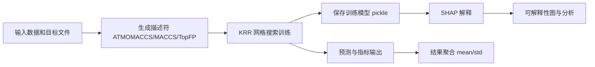

# ATMOMACCS 项目教学文档

## 文献与项目元信息
- 文献名称：An interpretable molecular descriptor for machine learning predictions in atmospheric science
- 来源（DOI）：https://doi.org/10.48550/arXiv.2510.20465
- 项目地址：https://arxiv.org/abs/2411.15500
- 模型权重地址：https://arxiv.org/abs/2411.15500

## 用途
本项目工具链用于大气分子性质预测与可解释性分析，覆盖描述符生成、模型训练、预测导出、结果统计和 SHAP 解释。

## 输入字段
| 类别 | 字段 | 说明 |
|---|---|---|
| CLI 参数 | version | 描述符版本 |
| CLI 参数 | data_path | 数据集路径 |
| CLI 参数 | desc | 描述符名称 |
| CLI 参数 | target | 目标文件名 |
| CLI 参数 | dataset | 数据集标识（Wang、GeckoQ、Ferraz-Caetano、Li） |
| CLI 参数 | seed | 随机种子 |
| CLI 参数 | shap | 是否计算 SHAP |
| CLI 参数 | generate_descriptors | 是否生成描述符 |
| 文件输入 | smiles.txt | 分子 SMILES 列表 |
| 文件输入 | 目标值文件 | 如 log_p_sat.txt、log_kwg.txt、log_kwiomg.txt、dvap.txt、tg.txt |
| 文件输入 | descriptors/* | 描述符文件（可由脚本生成） |
| SHAP 可选参数 | samples | 抽样样本量 |
| SHAP 可选参数 | kmeans | 聚类数 |

## 输出字段
| 输出类型 | 字段/文件 | 说明 |
|---|---|---|
| 训练结果 CSV（result_*.csv） | Train_sizes, Train_MAE, Train_R2, Train_MSE | 训练规模及训练集指标 |
| 训练结果 CSV（result_*.csv） | Test_MAE, Test_R2, Test_MSE | 测试集核心指标 |
| 训练结果 CSV（result_*.csv） | opt_alpha, opt_gamma, best_score, aavre% | 最优超参数与评分 |
| 预测 CSV（output_predictions_*.csv） | SMILES, predictions, target_values | 分子、预测值、真实值 |
| 汇总 CSV（results_summary_*.csv） | Descriptor, Seed, Dataset, Target, TrainSize, Test_MAE, Test_R2, Test_MSE | 跨目标对比结果 |
| 模型文件 | pickle/*.pkl | 训练模型序列化文件 |
| 可解释性文件 | shap/shap_values_*.pkl, shap/shap_averages_*.csv | SHAP 原始值与汇总值 |
| 图表输出 | plots/* | 学习曲线与可视化图表 |

## 实现方法
1. 描述符构建：基于 RDKit 与 ATMOMACCS 规则生成分子特征（含 ATMOMACCS、MACCS、TopFP）。
2. 模型训练：使用 Kernel Ridge Regression（RBF 核）并通过 GridSearchCV 搜索 alpha、gamma。
3. 评估流程：固定测试集切分，按不同训练规模计算 MAE、MSE、R2、AAVRE。
4. 可解释性：采用 SHAP KernelExplainer 计算特征贡献并输出解释结果。
5. 结果归纳：对多次实验输出进行均值和标准差汇总，并生成对比表。

## 1. 项目概览
ATMOMACCS 是一个面向大气有机分子性质预测的机器学习科研项目，核心目标是：
1. 构建和生成分子描述符（尤其是 ATMOMACCS 系列）。
2. 使用核岭回归（KRR）预测目标理化性质。
3. 用 SHAP 做可解释性分析，解释描述符对预测的贡献。

它支持多个数据集（如 Wang、GeckoQ、Ferraz-Caetano、Li），可以用于对比不同描述符的效果，并输出学习曲线、预测结果、均值和标准差统计文件。

## 2. 项目可以做什么（用户最关心）
这个项目可以用于：
1. 从 SMILES/分子数据生成多类描述符（ATMOMACCS、MACCS、TopFP）。
2. 训练 KRR 模型预测目标性质，例如 log_p_sat、log_kwg、log_kwiomg、dvap、tg。
3. 在固定测试集上评估模型性能（MAE、MSE、R2、AAVRE）。
4. 做不同训练样本规模下的学习曲线分析（观察数据量提升带来的误差变化）。
5. 多随机种子重复实验并聚合统计（均值/标准差），用于更稳健地比较方法。
6. 对训练好的模型做 SHAP 分析，解释哪些描述符维度最重要。
7. 结合 notebooks 和 visualization 脚本，生成论文或汇报可用图表。

## 3. 目录与架构

### 3.1 核心目录
- src/main.py: 统一 CLI 入口，串联描述符生成、KRR 训练和预测。
- src/model/: 描述符构建、KRR、SHAP 等核心算法代码。
- src/visualization/: 结果聚合和绘图分析脚本。
- src/slurm/: 批处理脚本，便于在集群上批量跑实验。
- data/: 四个数据集及其各自输出目录（descriptors、KRR_output、pickle、shap、plots）。
- notebooks/: 分析与可视化 notebook。

### 3.2 简化流程图


## 4. 关键文件作用
1. src/main.py
- 命令行入口。
- 根据参数选择描述符并触发生成，然后调用 KRR 主流程。

2. src/model/krr.py
- 训练与评估核心。
- 使用 GridSearchCV 对 KernelRidge 的 alpha 和 gamma 做网格搜索。
- 输出 result CSV、预测值 CSV、学习曲线图，并持久化最佳模型。

3. src/model/generate_ATMOMACCS.py 与 ATMOMACCS*.py
- 定义并生成 ATMOMACCS 描述符（不同版本）。

4. src/model/shap_vals.py
- 加载 pickled 训练模型和测试集，计算并保存 SHAP 值。

5. src/visualization/process_results.py
- 汇总多随机种子结果，生成 mean 和 std 文件，支持稳健比较。

6. notebooks/*.ipynb
- 数据分析、SHAP 展示、性能提升分析等科研复现内容。

## 5. 运行前准备
1. Python 3.12 环境（README 指定）。
2. 安装依赖（matplotlib、pandas、rdkit、scikit-learn、scipy、shap 等）。
3. 确认目标数据集目录下有必要文件：
- smiles.txt
- 目标值文件（如 log_p_sat.txt）
- descriptors 目录（可由脚本自动生成）

## 6. 典型运行方式
示例（Wang 数据集，ATMOMACCS v4，目标 log_p_sat）：

```bash
python src/main.py -v 4 -d data/Wang -t log_p_sat.txt -ds Wang -s 2435
```

执行后通常会在数据集目录产生：
1. descriptors 下的描述符文件。
2. KRR_output/results 下的性能结果 CSV。
3. KRR_output/output_predictions 下的测试集预测值。
4. pickle 下的训练模型文件。
5. shap 下的 SHAP 输入与输出文件。
6. plots 下的学习曲线或其他图表。

## 7. 部署和执行建议
该项目更偏科研脚本与实验流水线，不是 Web 服务部署型项目。推荐三种运行环境：
1. 本地开发机：用于单次调参与分析。
2. Jupyter 环境：用于结果可视化和论文图绘制。
3. Linux 或集群环境：配合 src/slurm 脚本做批量实验。

验证成功的标准：
1. 目标数据集目录下生成 descriptors、KRR_output、pickle、shap、plots。
2. result_*.csv 和 mean、std 文件内容完整。
3. notebook 可读取输出文件并画图。

## 8. 常见问题排查
1. 报错找不到目标文件：检查 -d 与 -t 是否匹配数据集路径。
2. SHAP 运行很慢：先使用 samples 或 kmeans 参数，或后处理时再单独跑 shap_vals.py。
3. 结果目录为空：确认随机种子、数据格式和描述符文件是否正确生成。
4. RDKit 安装失败：优先使用 conda 环境安装，避免纯 pip 在部分平台的兼容问题。

## 9. 对话记录（合并版）
### 用户问题
- 告诉我这个项目可以干什么

### 回答摘要
- 本项目可以生成大气化学相关分子描述符，训练 KRR 预测多个理化性质，输出多指标评估结果，支持多随机种子统计与学习曲线分析，并可通过 SHAP 完成可解释性研究。
- 项目定位是科研建模与分析流水线，适合复现实验、比较描述符与制作可视化图表。

### 用户问题
- 数据文件可以放在哪里以发挥作用

### 回答摘要
- 推荐将数据按 data/数据集名/... 结构放在项目根目录。
- 数据集名需与代码一致：Wang、GeckoQ、Ferraz-Caetano、Li。
- 每个数据集目录至少包含 smiles.txt、目标文件和 descriptors 子目录。
- 训练结果会自动写入对应数据集目录下的 KRR_output、pickle、shap、plots 等子目录。

### 用户问题
- 开始尝试复现该项目成果，所有脚本、数据、虚拟环境和输出都放在 test 文件夹

### 回答摘要
- 已将项目脚本复制到 test，并将四个数据集复制到 test/data/{Wang,GeckoQ,Ferraz-Caetano,Li}。
- 已在 test 创建虚拟环境 .venv 并安装 requirements 依赖。
- 已完成最小复现（ATMOMACCS_v4 + Ferraz-Caetano + dvap + seed=2435）。

### 用户问题
- 继续跑通所有目标

### 回答摘要
- 已完成并验证 6 个目标（ATMOMACCS_v4，seed=2435）：
  - Ferraz-Caetano: dvap
  - Wang: log_p_sat、log_kwg、log_kwiomg
  - GeckoQ: log_p_sat
  - Li: tg
- 对应 result、output_predictions、pickle 文件均已生成并核验时间戳。

### 用户问题
- 继续

### 回答摘要
- 已基于 6 个目标 result CSV 生成汇总文件：test/results_summary_ATMOMACCS_v4_seed2435.csv。
- 汇总口径：每个目标取最大训练规模对应行，提取 Test_MAE、Test_R2、Test_MSE。
